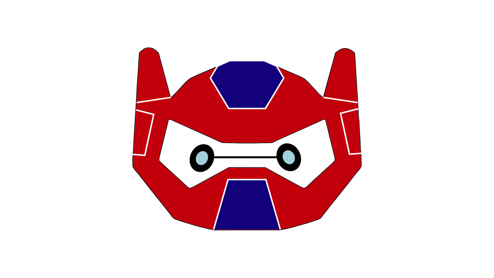
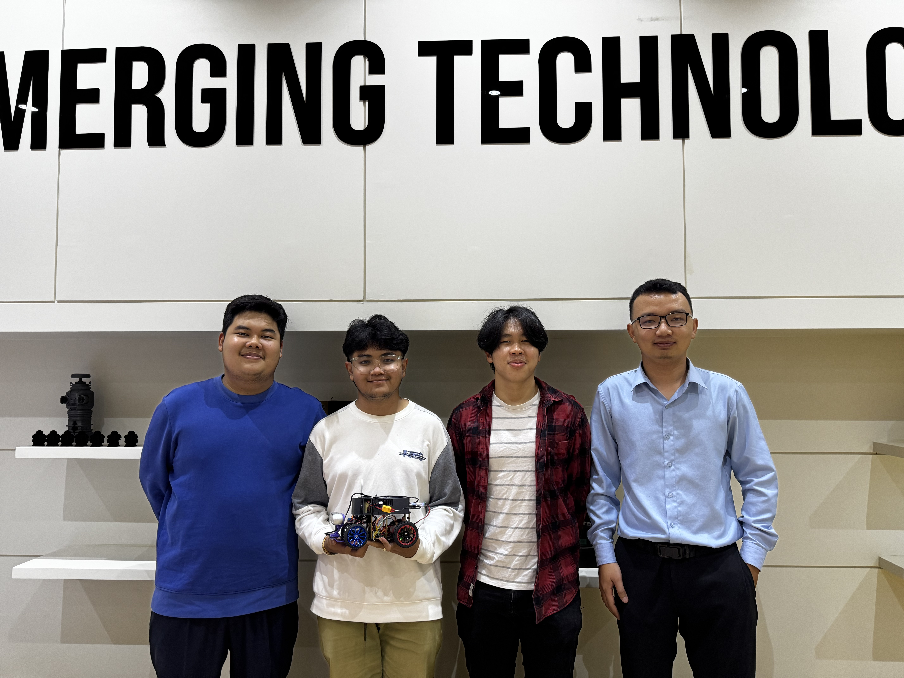
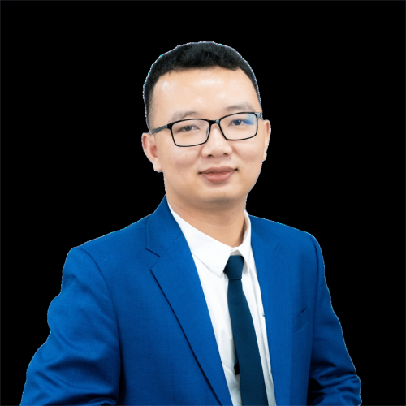

# WRO Future Engineers 2025 - TeamBaymax Motion (AUPP)

  
  &nbsp;&nbsp;
  

---
*"Apparently we needed to teach a car how to drive and follow traffic rules since humans keep forgetting." 🤷‍♂️🏎️💨*

---

## 📚 Table of Contents

- [🎯 What We Built](#-what-we-built)
- [👥 Meet Our Team](#-meet-our-team)
- [📁 What's In Here](#-whats-in-here)
- [🚀 How We Built It](#-how-we-built-it)
  - [Choosing Our Hardware](#choosing-our-hardware)
  - [Writing the Software](#writing-the-software)
  - [Making Everything Work Together](#making-everything-work-together)
- [🔧 What Our Car Can Do](#-what-our-car-can-do)
  - [Driving Itself](#driving-itself)
  - [Seeing and Understanding](#seeing-and-understanding)
  - [Smart Control](#smart-control)
- [🏁 How It Performs](#-how-it-performs)
  - [The Numbers](#the-numbers)
- [🛠️ Our Journey](#️-our-journey)
  - [Starting Small](#starting-small)
  - [Going Custom](#going-custom)
  - [Learning the Hard Way](#learning-the-hard-way)
  - [Making It Work](#making-it-work)
- [🏆 What Makes It Special](#-what-makes-it-special)
- [🚀 Want to Try It?](#-want-to-try-it)
- [📜 License & Copyright](#-license--copyright)

---

## 🎯 What We Built

This repository holds all the engineering work behind our autonomous vehicle for the **WRO Future Engineers competition 2025**. We've built a car that can see, think, and drive completely on its own - no remote control, no human input, just pure autonomy.

**What makes it special:**

Our car drives itself from start to finish without any help, spotting and avoiding obstacles in real-time using advanced computer vision to recognize red and green pillars. It makes smart decisions while navigating through challenges, all powered by fine-tuned control systems that keep everything smooth and fast.

---

## 👥 Meet Our Team

<em>Team Photo - From left to right: Paulen, Bunkheang, Panha, and Prof. Theara (Coach)</em>

---

<table width="100%">
<tr>
<td width="30%" valign="top" align="center">
<h4><strong>Prof. SENG Theara </strong></h4>

</td>
<td width="70%" valign="middle">
<h4><strong>Role:</strong> Team Coach</h4>
<h4><strong>Origin:</strong> Siem Reap, Cambodia</h4>
<h4><strong>Email:</strong> <a href="mailto:t.seng@aupp.edu.kh">t.seng@aupp.edu.kh</a></h4>
<strong>Bio:</strong> An innovative tech enthusiast and lecturer at the American University of Phnom Penh (AUPP) with a Master's degree in Robotics from France. He has experiences in microcontroller programming, sensor integration, and IoT systems. As our team coach, he provided expert guidance on robotics fundamentals, autonomous systems, and AI integration while mentoring us through complex technical challenges and project development. His passion for cutting-edge technologies and hands-on approach to teaching helped shape our understanding of advanced robotics and prepared us for the WRO competition.
</td>
</tr>
</table>

---

<table width="100%">
<tr>
<td width="70%" valign="middle">
<h4><strong>Role:</strong> 3D Design & Software Developer</h4>
<h4><strong>Origin:</strong> Battambang, Cambodia</h4>
<h4><strong>Email:</strong> <a href="mailto:2024033chamroeun@aupp.edu.kh">2024033chamroeun@aupp.edu.kh</a></h4>
<strong>Bio:</strong> A junior at the American University of Phnom Penh (AUPP) majoring in Information and Communication Technology (ICT). Specialized in 3D modeling and vehicle design using CAD software. Responsible for designing and optimizing the car's 3D components and mechanical structure. Also contributed to software development and played a key role in project planning and coordination. His academic background in ICT combined with 3D design expertise helped create the physical foundation of our autonomous vehicle.
</td>
<td width="30%" valign="top" align="center">
<h4><strong>CHAMROEUN Vireakpanha</strong></h4>

</td>
</tr>
</table>

---

<table width="100%">
<tr>
<td width="30%" valign="top" align="center">
<h4><strong>HENG BunKheang</strong></h4>

</td>
<td width="70%" valign="middle">
<h4><strong>Role:</strong> Lead Software Developer</h4>
<h4><strong>Origin:</strong> Phnom Penh, Cambodia</h4>
<h4><strong>Email:</strong> <a href="mailto:2023302heng@aupp.edu.kh">2023302heng@aupp.edu.kh</a></h4>
<strong>Bio:</strong> A sophomore at the American University of Phnom Penh (AUPP) majoring in Information and Communication Technology (ICT) with a focus on software engineering and robotics. Serves as the lead programmer and system architect for the autonomous vehicle project. Specialized in ROS2 development, sensor integration, and control systems. Responsible for the overall software architecture, PID controller implementation, and real-time decision-making algorithms. His comprehensive programming skills and system design experience ensure seamless integration between all components of our autonomous vehicle.
</td>
</tr>
</table>

---

<table width="100%">
<tr>
<td width="70%" valign="middle">
<h4><strong>Role:</strong> Hardware & Software Developer</h4>
<h4><strong>Origin:</strong> Battambang, Cambodia</h4>
<h4><strong>Email:</strong> <a href="mailto:2023225chhun@aupp.edu.kh">2023225chhun@aupp.edu.kh</a></h4>
<strong>Bio:</strong> A junior at the American University of Phnom Penh (AUPP) and Fort Hays State University (FHSU), majoring in Information Technology Management/Computer Science (ITM/CS). Specialized in mechanical and hardware work while also contributing to software development. Has been instrumental in car building from the early TurtleBot3 experiments to the final autonomous vehicle. Worked on both software and hardware integration throughout the project's evolution, providing crucial support in mechanical assembling, component integration, and system troubleshooting. His hands-on approach and versatility in both hardware and software made him a good contributor to the team's success.
</td>
<td width="30%" valign="top" align="center">
<h4><strong>CHHUN Paulen</strong></h4>

</td>
</tr>
</table>
</td>

---

## 📁 What's In Here

### The Documentation 
* **`t-photos/`** - Photos of our team (the official one and some fun shots)
* **`v-photos/`** - Pictures of our car from every angle you could want
* **`video/`** - Videos showing how our car actually drives
* **`schemes/`** - All the wiring diagrams and how everything connects

### The Technical 
* **`src/`** - The code that makes everything work, including trained AI models (YOLOv8 for obstacle detection)
* **`models/`** - 3D files for parts we designed and printed ourselves, including AI models that we use for computer vision
* **`other/`** - Extra documentation and setup guides

---

## 🚀 How We Built It

Building our autonomous vehicle was quite the journey - lots of trial and error, late nights debugging, and those "aha!" moments when everything finally clicked. Here's how we turned our crazy idea into reality:

### **Choosing Our Hardware**
We had to be smart about every component since we're students on a budget (aka broke), but we also needed serious performance. Also these components are also selected by our coach as well because he knows everything.

- **The Brain**: NVIDIA Jetson Orin Nano Super - This little computer is honestly incredible. It's got ARM64 architecture with AI acceleration that lets us run our machine learning models without breaking a sweat
- **Operating System**: Ubuntu 22.04.5 LTS - We chose this because it's rock-solid stable, and we needed something that wouldn't crash during competitions
- **The Eyes**: Intel RealSense D455 camera - This was a game-changer for us. It gives us both regular color vision and depth perception, so our car can actually "see" in 3D
- **Balance and Navigation**: BNO055 IMU sensor that tells us exactly how our car is tilted, turning, or moving. Think of it as our car's inner ear
- **Movement**: Custom motor setup with encoders - We needed precise control, so we went with motors that can tell us exactly where they are and how fast they're spinning
- **The Body**: We 3D-designed and printed our own chassis. After breaking a few prototypes, we finally got one that could handle all our gear and look good doing it

### **Writing the Software**
This is where things got really interesting (and mathematical, if we're being honest):

We didn't just jump into coding - our coach taught us the theory behind everything first. We spent hours going through equations, learning about different algorithms and methods that could work for autonomous navigation. Then came the fun part: experimenting with these concepts ourselves, both independently and with our coach's guidance.

- **The Foundation**: ROS2 Humble became our best friend - it's like having a universal translator that lets all our different components talk to each other seamlessly
- **Teaching It to See**: We spent weeks training YOLOv8 AI models to spot those red and green pillars. We used both YOLOv8s and YOLOv8n versions, created our own dataset by taking hundreds of photos in different lighting conditions, and then optimized everything into .engine files so it runs super fast on our Jetson
- **Making It Drive Smoothly**: PID controllers sound simple in theory, but wow, did we spend countless hours tweaking those parameters and working through the math behind them. Our coach helped us understand the equations that make these controllers work, then we experimented with different tuning methods. Every tiny adjustment changed how our car behaved, but once we got it right, it felt like magic
- **Putting It All Together**: We built algorithms that take input from our camera, IMU, and motor sensors, then make split-second decisions about where to go and how fast to get there. This involved lots of mathematical calculations and algorithmic thinking that our coach guided us through
- **Keeping It Safe**: We learned the hard way to always have backup plans. Emergency stops, error recovery, and fail-safes became our saving grace during those "oh no" moments

### **Making Everything Work Together**
The real challenge wasn't building individual parts - it was getting them to play nice together. We spent weeks calibrating sensors, testing under different lighting conditions, and fine-tuning everything until our car could handle whatever the competition threw at it. Every bug we fixed and every improvement we made brought us closer to having something we could be truly proud of.

---

## 🔧 What Our Car Can Do

### **Driving Itself**
- Follows walls to navigate the track smoothly
- Uses an AI model to keep track of obstacles and avoid them
- Uses sensors and algorithms to stay in bounds
- Adjusts speed based on what's ahead

### **Seeing and Understanding**
- **Pillar Detection**: Spots red and green pillars even when lighting changes
- **Depth Vision**: Knows exactly how far away things are
- **AI-Powered Tracking**: Uses machine learning to monitor and predict obstacle movements

### **Smart Control**
- **Steering**: PID controllers we fine-tuned until they were perfect
- **Speed**: Knows when to go fast and when to slow down
- **Safety**: Emergency stops when something unexpected happens

---

## 🏁 How It Performs

Right now, our car can handle:

1. **Open Challenge**: Completing laps autonomously with smooth, optimized racing lines
2. **Obstacle Challenge**: Avoiding obstacles while maintaining good speed
   - *Note: We're still working on the parking part - it's integrated but not quite there yet*

### **The Numbers**
- **Speed**: Fast enough to be competitive, smart enough to stay safe (but still hit the wall during test)
- **Vision Range**: Can see obstacles and pillars from a good distance
- **Response Time**: Reacts in real-time (under 100ms)
- **Accuracy**: Rarely misses a pillar, even in tricky lighting

---

## 🛠️ Our Journey

### **Starting Small**
We began with simpler setups - a Raspbot with omniwheels and a TurtleBot3 - just to get our feet wet with robotics and understand how ROS2 works.

### **Going Custom**
Once we felt confident, we decided to build everything from scratch using the Jetson Orin Nano. This is where things got real.

### **Learning the Hard Way**
- Had to learn ROS2 and Linux from zero (lots of late nights!)
- Spent countless hours debugging camera issues and motor control
- Rebuilt our chassis more times than we care to admit
- But every problem taught us something new

### **Making It Work**
- Fine-tuned our PID controllers until the car drove like a dream
- Got our vision system to reliably spot pillars in all kinds of lighting
- Integrated all our sensors so they work together seamlessly
- Built something we're genuinely proud of

---

## 🏆 What Makes It Special

- **100% Autonomous**: Once it starts, we don't touch it - the car handles everything
- **Smart Vision**: Recognizes pillars even when the lighting isn't perfect
- **Easy to Upgrade**: We designed it so we can easily add new features or improve existing ones

---

## 🚀 Want to Try It?

Everything you need to build and run our car is in this repository. We've documented each part thoroughly so you can understand how it works and even improve on our design.

---

*This represents months of hard work, learning, and problem-solving. We started with a simple goal - build a car that could drive itself - and ended up with something that genuinely impressed us. Hope it inspires you too!*

---

## 📜 Copyright

**MIT License**

Permission is hereby granted, free of charge, to any person obtaining a copy of this software and associated documentation files (the "Software"), to deal in the Software without restriction, including without limitation the rights to use, copy, modify, merge, publish, distribute, sublicense, and/or sell copies of the Software, and to permit persons to whom the Software is furnished to do so, subject to the following conditions:

The above copyright notice and this permission notice shall be included in all copies or substantial portions of the Software.

**THE SOFTWARE IS PROVIDED "AS IS", WITHOUT WARRANTY OF ANY KIND, EXPRESS OR IMPLIED, INCLUDING BUT NOT LIMITED TO THE WARRANTIES OF MERCHANTABILITY, FITNESS FOR A PARTICULAR PURPOSE AND NONINFRINGEMENT. IN NO EVENT SHALL THE AUTHORS OR COPYRIGHT HOLDERS BE LIABLE FOR ANY CLAIM, DAMAGES OR OTHER LIABILITY, WHETHER IN AN ACTION OF CONTRACT, TORT OR OTHERWISE, ARISING FROM, OUT OF OR IN CONNECTION WITH THE SOFTWARE OR THE USE OR OTHER DEALINGS IN THE SOFTWARE.**

**© 2025 Team Baymax Motion**  
*American University of Phnom Penh (AUPP), Cambodia*
