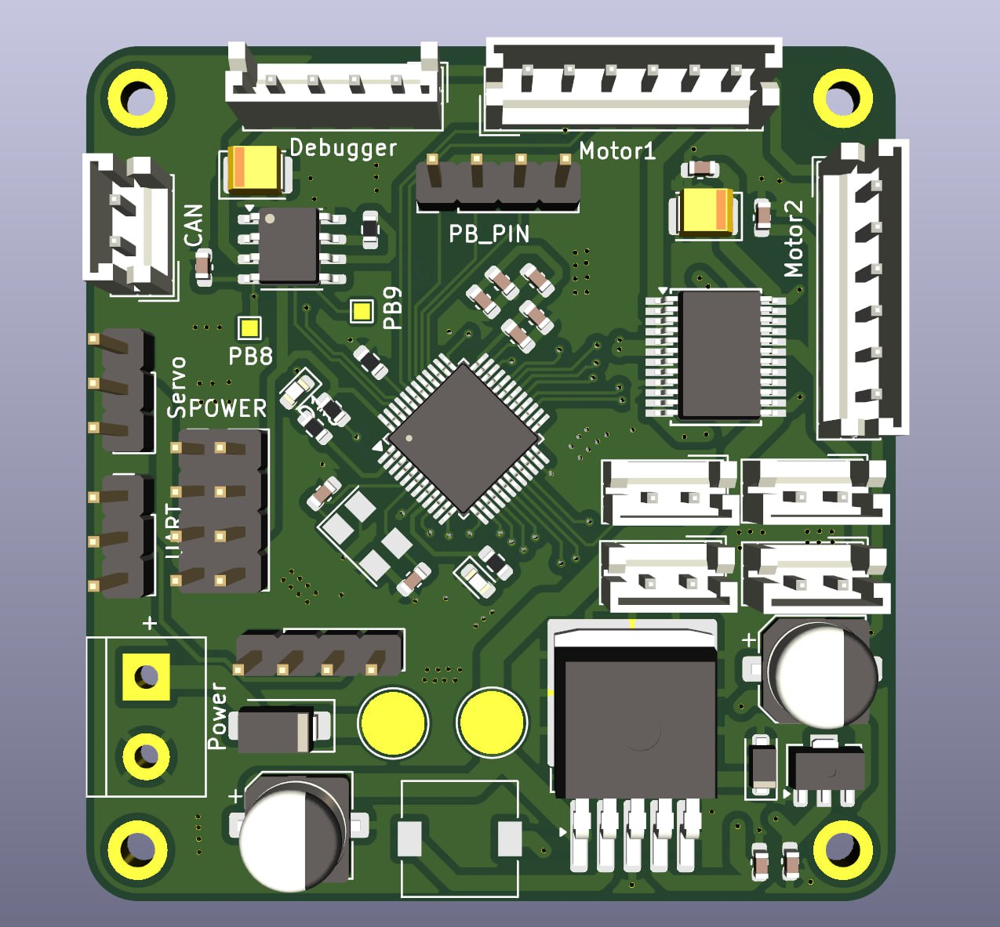
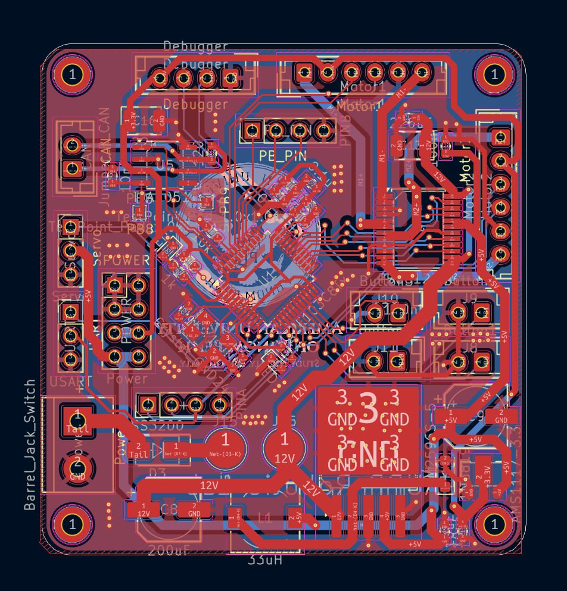
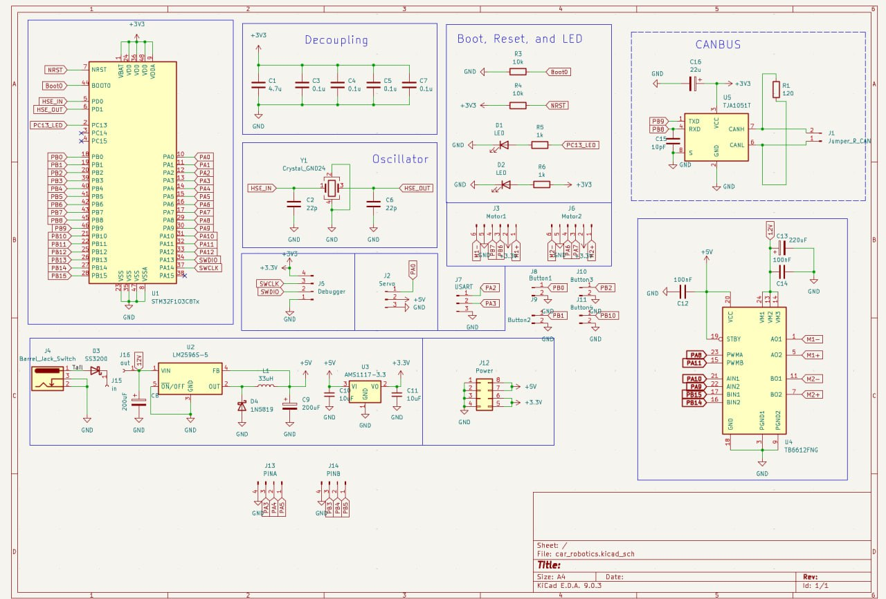

# Mobility Management

## List of Component
- **DC Motor Model:** JGA25-370 [Link](https://www.amazon.sg/JGA25-370-Geared-Electric-Torque-1360rpm/dp/B0BCFS43VW?th=1)
   - **Voltage**: 12V
   - **Speed**: 280 RPM
   - **Stall Torque**: 1.7 KG.CM
   - **Encoder**: JGA25-370
   - Why chose this? Because it fits perfectly for robot:
     - Precision & Control: It's ideal for steering, also offer nuanced directional control for the vehicle
     - Balance both power & speed: Provide enough torque to move the car while maintaining stable speed.
     - Built-in Encoders: the built-in encoder act as an eye for the motor, feeding real-time data back to the board.
 - **Base Chassis** : Lower Chassis [Part](https://youtu.be/ulTM1uV1Bvg?si=f2Lna6793y4V5BLy)
 - **Upper Chassis** : [3D Printing Part]() that use to store Jetson Nano Orin
 - **Servo** :
 - **Wheel** : Part [Link](https://youtu.be/ulTM1uV1Bvg?si=f2Lna6793y4V5BLy)
 - **Hokuyo UST-30LX Lidar** : [Link](https://www.hokuyo-aut.jp/search/single.php?serial=233)
   - **Max Range** : 30 meters
   - **Detection Angle** : 270 degrees
   - **Anti-ambient light**
 - **Intel RealSense Depth Camera D455** : [Link](https://www.intel.com/content/www/us/en/products/sku/205847/intel-realsense-depth-camera-d455/specifications.html)
 - **Custom Motor Controller Board** 
 - **Control Area Network(CAN) Bus**
 - **RealSense Camera Mounting** : [3D Printed Part]()
 - **Lidar Mounting** : [3D Printed Part]()
 - **IMU BNO055** : Mainly use For lap counting [Link](https://www.adafruit.com/product/2472?srsltid=AfmBOor3sAo9Rdx37jv7NFbS13hn4i-PcHyRNyb_V6hFcZzWmqiRIFs9)
 - **Other Parts**

## Power
### Battery Detail
TCB Li-Po Rechargeable Battery (3S 1100mAh)

- Brand: TCB
Battery Cell Composition: Lithium Polymer (Li-Po)
- Battery Capacity: 1100 Milliamp Hours
- Capacity: 1100 mAh. 
- Estimated recharge time: 1.5 – 2 hours.

Power Supply Hierarchy:
- 2 Battery 12 V each
- One for:
  -  for Jetson 12 V (RealSense Camera and other through USB)
- Another for: 
  - Lidar 12 V
  - Motor 12 V

##  Custom Motor Controller Board Documentation

### Overview

Our coach help guide us designed and manufactured a custom PCB (Printed Circuit Board) to serve as the central control system for our robot. This board integrates motor control, CAN bus communication, power distribution, and sensor interfaces into a single, compact solution.

### Board Images

**3D(Board.jpeg) : Top Layer (Component Side)**

- Green PCB with clearly labeled sections
- White silkscreen labels for easy identification
- Organized layout with dedicated functional zones

**Copper Traces: Bottom Layer** - Reveals the internal wiring and circuit routing

- Red copper traces show signal and power routing
- Professional PCB design with proper trace spacing
- Ground planes visible for noise reduction

**Schematic Diagram** - Complete electrical design documentation

- Full circuit schematic showing all connections
- Component values and part numbers specified
- Functional blocks clearly defined

---

### Connection to Main System

This custom board serves as the **motor control interface** between:
- **Input**: Jetson Orin Nano (high-level commands via CAN bus)
- **Output**: DC motors and servo (low-level PWM control)

---

### Board Files Available

- **Schematic**: Complete circuit diagram (shown in [Schematic](./Schematic.jpeg))
- **PCB Layout**: Top and bottom copper layers ([3D](./Board_3D.jpeg) & [Copper](./Board.jpeg))

*For complete technical details, refer to the schematic diagram and PCB layout files in this directory.*

---
