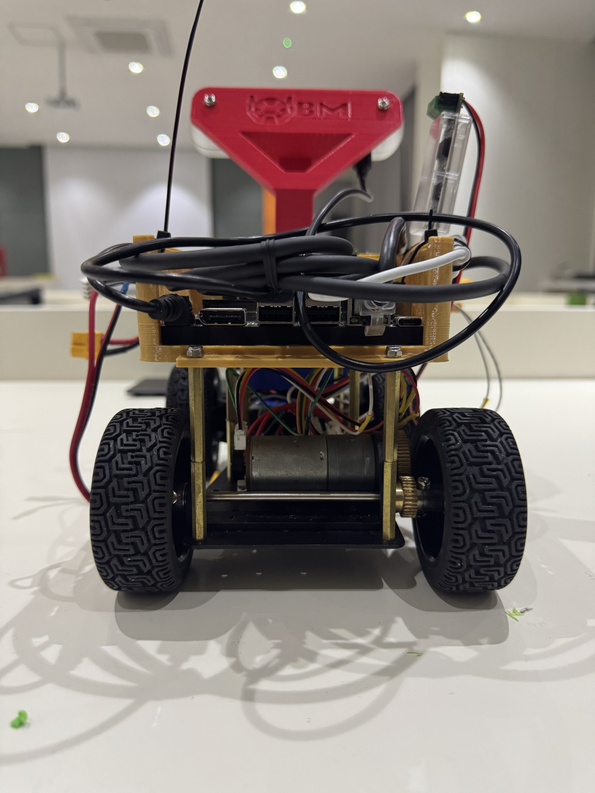
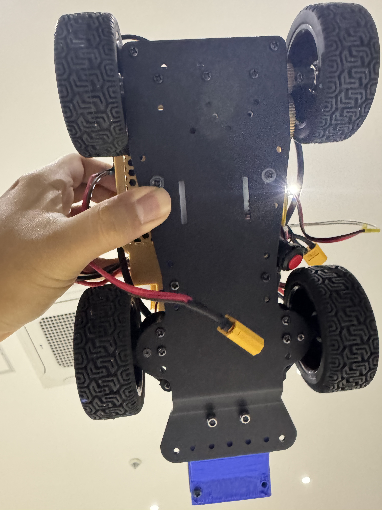
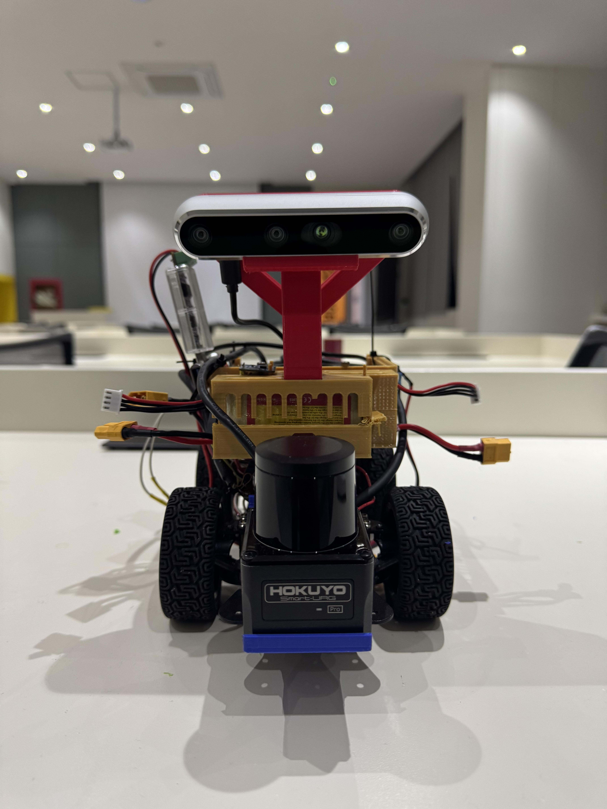
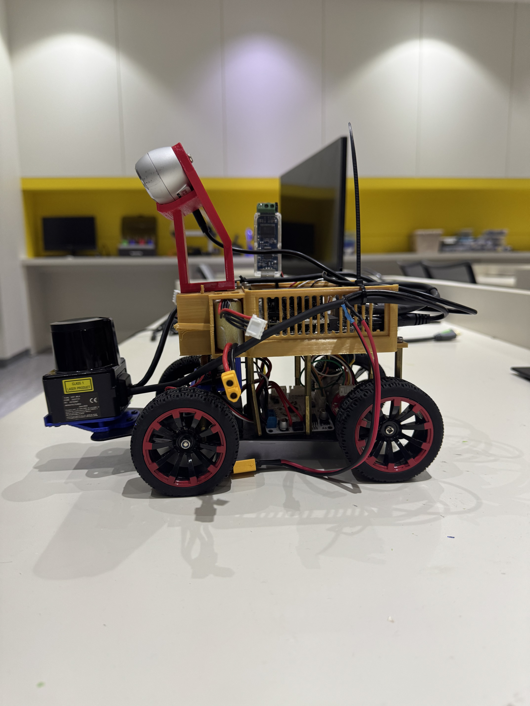
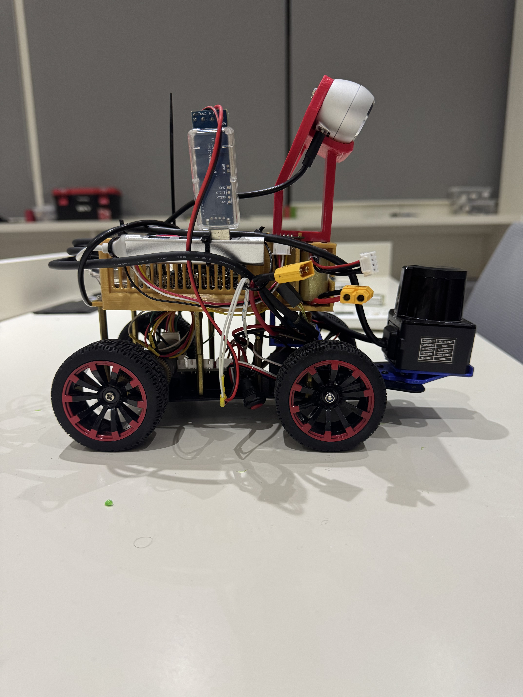
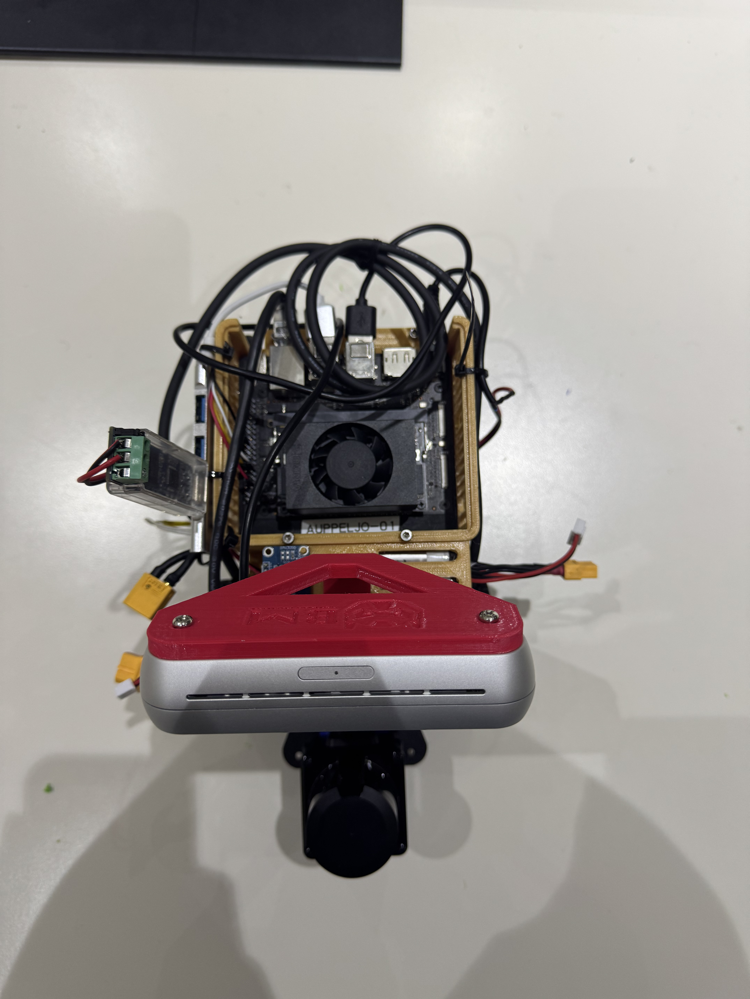
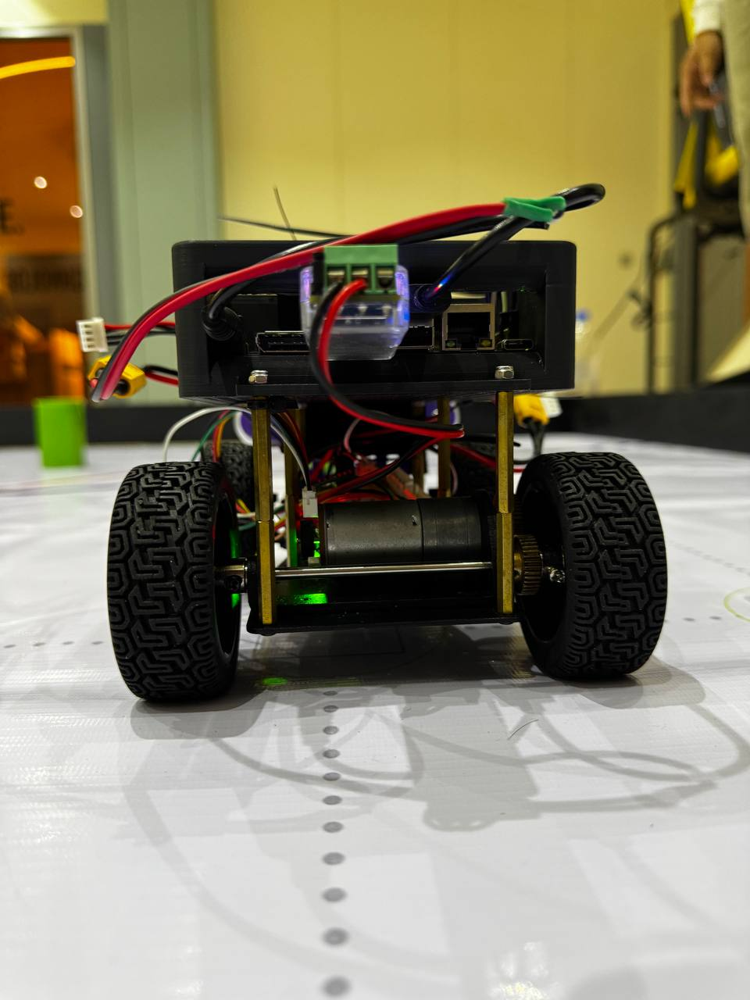
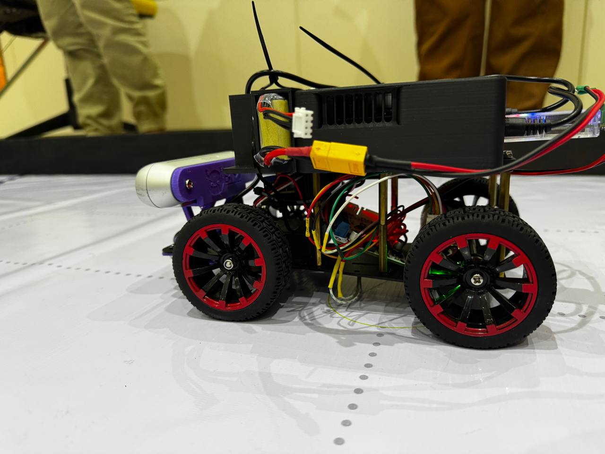
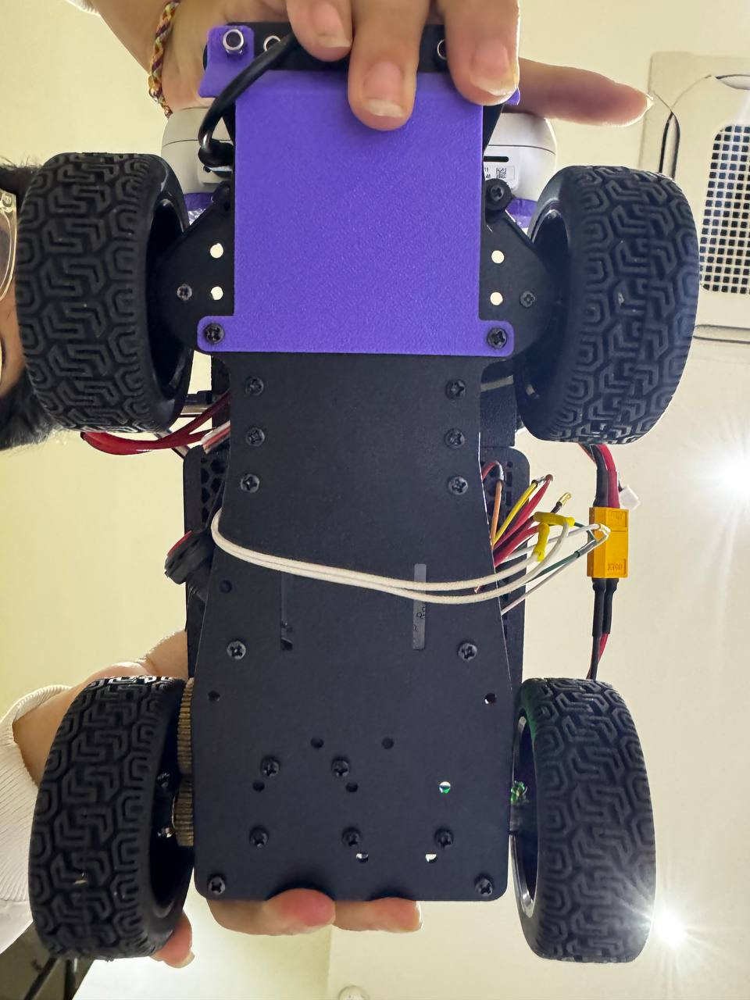

# Vehicle Photos

This folder is a complete photo gallery of our robot, showing it from each and every angle so you can really get a sense of its design and build quality. Whether you're curious about the details or want to see how everything fits together, these images have you covered.
## International Round:

What you'll find inside:
- **Back.jpg** - The back part of the robot where you can see how we handle Jetson's port
- **Bottom.jpg** - The underside of the car, showing the base chasis 
- **Front.jpg** - Main view of our two most important component. Lidar and Camera placement.
- **Left.jpg** and **Right.jpg** - Both sides of the vehicle, where you can check out the battery placement, profile, wheel placement, and any side-mounted component.
- **Top.jpg** - View from the top of our robot. You'll see the Jetson's fan and messy cables.

 Side | Photo |
|:-------------:|:-------------:|
| **Back** |  | 
| **Bottom** |  | 
| **Front** |  | 
| **Left** |  | 
| **Right** |  | 
| **Top** |  | 

## National Round:
What you'll find inside:

- **Front_robot.jpeg** – A clear shot of the car from the front, showing off the sensors and the main body.
- **Back_robot.jpeg** – The rear view, where you can see the motor setup and how the wiring is managed. (Apologize for the messy wiring!)
- **Side_robot1.jpeg** and **Side_robot2.jpeg** – Both sides of the vehicle, so you can check out the profile, wheel placement, and any side-mounted components.
- **Top_Robot.jpeg** – A bird’s-eye view that reveals the overall layout, including the placement of the main board, battery, and camera.
- **Under_robot.jpeg** – The underside of the car, showing the chassis, wiring, and how everything is mounted underneath.

 Side | Photo |
|:-------------:|:-------------:|
| **Front** |  | 
| **Back** |  | 
| **Right** |  | 
| **Left** |  | 
| **Top** |  | 
| **Bottom** |  | 

These photos are meant to make it easy for anyone to understand how our vehicle is put together, whether you're building your own, reviewing our work, or just want a closer look at the engineering. If you need more detail or want to see a specific part, let us know!